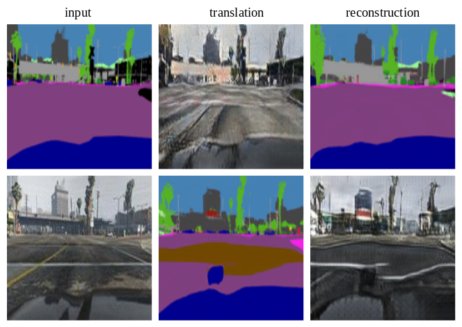

# Adversarial Self-Defense for Cycle-Consistent GANs
This is the official implementation of the CycleGAN robust to self-adversarial attacks
used in paper "Adversarial Self-Defense for Cycle-Consistent GANs" by Dina Bashkirova, Ben Usman and Kate Saenko, NeurIPS'2019.
[Paper](https://papers.nips.cc/paper/2019/file/b83aac23b9528732c23cc7352950e880-Paper.pdf)

In this repository you can find the extension of the original 
implementation of CycleGAN in pytorch. This extension contains 
two defense techniques against the self-adversarial attacks 
performed by the unsupervised image-to-image translation methods 
that hold the cycle-consistency property. 
More information on self-adversarial attacks can be found in 
our paper. 

You can find the instructions on how to train and test the model 
with additional guess loss or with Gaussian noise 
[here](docs/howto_guess.md) and [here](docs/howto_noisy.md) 
respectively.

In order to reproduce our results, you can find all the configuration
 files in [configs](configs) directory.
 

